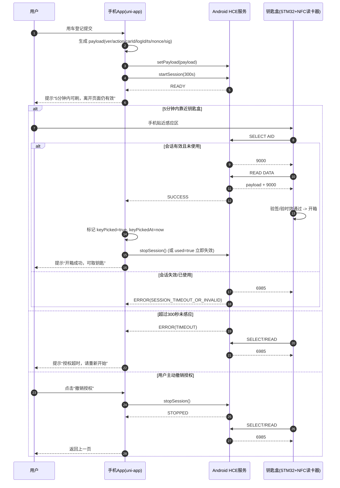

# 手机-盒子-NFC 开箱完整时序图

> 说明：本图对应 `usecar -> keyPickup -> Android HCE -> 钥匙盒` 的完整链路，包含成功、超时与手动撤销三种分支。

## 关键约束

- 授权有效期：`300s`（5分钟）。
- 授权单次有效：盒子读取成功一次后立即失效（`used=true` 或 `stopSession`）。
- 页面退出不自动 `stopSession`：满足“退出取钥匙页/锁屏后台仍可刷”的现场需求。
- 手动撤销优先级最高：撤销后必须立即返回 `6985`。
